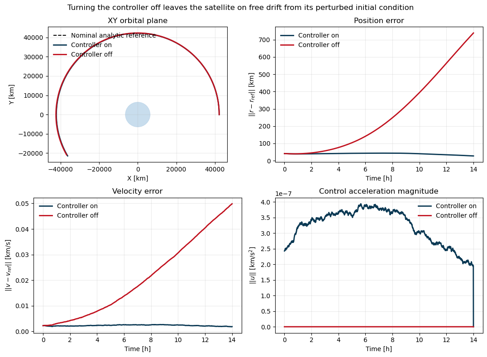

## {.manual-title-slide}

::: {.metro-title-slide}
::: {.metro-title-main}
PML 10. Normalizing Flows (for Simulation-Based Inference)
:::

::: {.metro-title-sub}
Probabilistic Machine Learning Reading Group
:::

::: {.metro-title-rule}
:::

::: {.metro-title-meta}
::: {.metro-title-author}
Roi Naveiro
:::

::: {.metro-title-date}
March 25, 2026
:::

::: {.metro-title-institute}
CUNEF Universidad
:::
:::
:::

## A Motivating Example

- **Geostationary Earth Orbit (GEO)** is a circular orbit about 36,000 km above the equator.
- The orbital period is one day.
- The satellite appears approximately fixed over one longitude on Earth.
- This makes GEO valuable for continuous communication, broadcasting, and weather monitoring.

---

## A Two-Body World

The satellite would satisfy

$$
\ddot{\mathbf r}(t)
=
-\frac{\mu}{\|\mathbf r(t)\|^3}\mathbf r(t).
$$

- Here $\mu$ is Earth's gravitational parameter.
- In this simplified world, the orbit is fully determined by the initial position and velocity.

---

## Placing A Satellite In GEO

Then, to place a satellite in GEO, we would simply:

  - choose the GEO radius,
  - give it the correct tangential velocity,
  - let the two-body force do the rest.

---

## The Ideal GEO Orbit

In that case, the ideal satellite orbit would satisfy

$$
\mathbf{r}^*(t)=
\begin{bmatrix}
a\cos(\lambda_0+\omega t)\\
a\sin(\lambda_0+\omega t)\\
0
\end{bmatrix},
\qquad
\omega=\sqrt{\frac{\mu}{a^3}}.
$$

with corresponding target velocity $\mathbf{v}^*(t)$.

---

## Real GEO Satellites Drift

The dynamics are affected by more than central gravity:

$$
\mathbf a(\mathbf r(t),t)
\simeq
\mathbf a_{\mathrm{grav}}
+ \mathbf a_{J_2}
+ \mathbf a_{3B}
+ \mathbf a_{R}.
$$

- $\mathbf a_{J_2}$: Earth oblateness
- $\mathbf a_{3B}$: Sun and Moon
- $\mathbf a_R$: solar radiation pressure

---

## Why We Need Control

So we need a controller that applies corrective acceleration $\mathbf a_C$ to keep the satellite near the target orbit.

$$
\mathbf a(\mathbf s(t),t,\boldsymbol\phi)
\simeq
\mathbf a_{\mathrm{grav}}
+ \mathbf a_{J_2}
+ \mathbf a_{3B}
+ \mathbf a_{R}
+ \textcolor{red}{\mathbf a_{C}(\mathbf s(t),t,\boldsymbol\phi)}.
$$

---

## A Controller: PD Station-Keeping

$$
\mathbf s(t)=
\begin{bmatrix}
\mathbf r(t)\\
\mathbf v(t)
\end{bmatrix}
\in\mathbb R^6.
$$

---

## A Controller: PD Station-Keeping

Let

$$
\Delta \mathbf r_t=\mathbf r(t)-\mathbf r^*(t),
\qquad
\Delta \mathbf v_t=\mathbf v(t)-\mathbf v^*(t).
$$

Then a simple proportional-derivative policy is

$$
\mathbf a_C^{PD}(\mathbf r_t,t,\boldsymbol\phi)
=
-K_p\,\Delta \mathbf r_t
-K_d\,\Delta \mathbf v_t,
\qquad
\boldsymbol\phi=(K_p,K_d).
$$

- $K_p$: how strongly we react to position error
- $K_d$: how strongly we damp velocity error

---

## The Effect of the Controller

{fig-align="center" width=90%}

---

## The Inference Problem

Suppose an observer collects a trajectory over an observation window:

$$
\mathcal D=\{ \mathbf s(t_j),t_j\}_{j=1}^J,
$$

where

$$
\mathbf s(t_j)=
\big[x(t_j),y(t_j),z(t_j),\dot x(t_j),\dot y(t_j),\dot z(t_j)\big]^\top.
$$

---

## The Inference Problem

Can we infer the controller parameters $\boldsymbol\phi$ from the observed orbit?

---

## A Bayesian Approach

The observer models the satellite with the SDE

$$
d\mathbf s(t)
=
\mathbf f(\mathbf s(t),t,\boldsymbol\phi)\,dt
+ \mathbf G\,d\mathbf W(t),
$$

where

$$
\mathbf f(\mathbf s(t),t,\boldsymbol\phi)
=
\begin{bmatrix}
\mathbf v(t)\\
\mathbf a(\mathbf s(t),t,\boldsymbol\phi)
\end{bmatrix}.
$$

---

## The Model Components

The acceleration is

$$
\mathbf a(\mathbf s(t),t,\boldsymbol\phi)
=
\mathbf a_{\mathrm{grav}}
+ \mathbf a_{J_2}
+ \mathbf a_{3B}
+ \mathbf a_R
+ \mathbf a_C(\mathbf s(t),t,\boldsymbol\phi).
$$

- $\mathbf a_{\mathrm{grav}}+\mathbf a_{J_2}+\mathbf a_{3B}+\mathbf a_R$: known physics
- $\mathbf a_C(\mathbf s(t),t,\boldsymbol\phi)$: controller action
- Unknown parameters: $\boldsymbol\phi=(K_p,K_d)$

---

## The Bayesian Model

Once $\mathcal D$ is observed, Bayesian inference targets

$$
p(\boldsymbol\phi\mid \mathcal D)
\propto
p(\mathcal D\mid \boldsymbol\phi)\,p(\boldsymbol\phi).
$$

---

## This Likelihood is very Hard!

- The dynamics are nonlinear.
- The transition density of the SDE is not available in closed form in general.

:::{.fragment}
We do not have an explicit formula for the likelihood of the observed path:

$$
p\big(\mathbf s(t_1),\mathbf s(t_2),\ldots,\mathbf s(t_J)\mid \boldsymbol\phi\big).
$$
:::

---

## But We Can Simulate from the SDE!

- Even if the likelihood is unavailable, we can simulate trajectories from the model.

$$
\mathbf s(t) \sim p(\cdot\mid \boldsymbol\phi).
$$

- Numerically solving the SDE, we can generate as many trajectories as we want for any given $\boldsymbol\phi$.

- Keep only the observed times.

---

## How Do We Do Bayesian Inference With Only A Simulator?

SBI notation:

$$
\theta := \boldsymbol\phi,
\qquad
x := \big(\mathbf s(t_1),\ldots,\mathbf s(t_J)\big).
$$

---

## How Do We Do Bayesian Inference With Only A Simulator?

- We can simulate from the prior and evaluate its density:
$$
\theta\sim p(\theta),
$$

- We can simulate from the likelihood but not evaluate its density:
$$
x\sim p(x\mid \theta).
$$

---

## The Goal

- Given an observed trajectory $x_o$, we want to learn the posterior

$$
p(\theta\mid x_o)
\propto
p(x_o\mid \theta)\,p(\theta).
$$

---

## An Idea

- Imagine a family of conditional densities $q_\phi(\theta\mid x)$ with three key properties:
- **Flexible** enough to approximate complicated posteriors $p(\theta\mid x)$
- **Easy to evaluate** $\log q_\phi(\theta_i\mid x_i)$
- **Easy to sample from** $q_\phi(\theta\mid x)$

## How Would We Find the Best $q_\phi$?

- Generate many simulated pairs

$$
\theta_i\sim p(\theta),
\qquad
x_i\sim p(x\mid \theta_i).
$$

- Then fit $\phi$ by minimizing
$$
\hat\phi
=
\arg\min_\phi
\frac{1}{N}\sum_{i=1}^N
\big[-\log q_\phi(\theta_i\mid x_i)\big].
$$

## Equivalently, in the limit

$$
\hat\phi
\approx
\arg\min_\phi
\mathbb E_{p(\theta,x)}[-\log q_\phi(\theta\mid x)].
$$

- Note that, to evaluate the objective, we only need to evaluate $q_\phi(\theta\mid x)$!

---

## Why Does This Recover The Posterior?

- The loss is an average KL divergence plus a constant:

$$
\mathbb E_{p(x)}
\Big[
\mathrm{KL}\!\big(p(\theta\mid x)\,\|\,q_\phi(\theta\mid x)\big)
\Big] + C
$$

where $C$ does not depend on $\phi$.

- Therefore the optimum is reached when

$$
q_\phi(\theta\mid x)\approx p(\theta\mid x).
$$

---

## After Training

- We only need to plug in the observed trajectory:

$$
q_\phi(\theta\mid x_o).
$$

- This gives a learned approximation to the posterior.
- That is the basic idea behind **neural posterior estimation**.

---

## Why One Round Is Often Wasteful

- In principle, $q_\phi(\theta\mid x)$ is being trained for many possible data sets $x$.
- But in our problem we only care about one data set: $x_o$.
- So most simulations are useful only if they are informative near $x_o$.

---

## SNPE Uses Multiple Rounds

- Recall that for training we need pairs $(\theta_i,x_i)$ where $\theta_i\sim p(\theta)$ and $x_i\sim p(x\mid \theta_i)$.

- Round 1 samples from the prior:
$$
\tilde p_1(\theta)=p(\theta).
$$

- Train a first approximation $q_{\phi_1}(\theta\mid x)$.

---

## Later Rounds Focus Near $x_o$

- Use the current approximation at the observed data as a proposal:
$$
\tilde p_r(\theta)\approx q_{\phi_{r-1}}(\theta\mid x_o).
$$

- Then simulate new pairs
$$
\theta_i\sim \tilde p_r(\theta),
\qquad
x_i\sim p(x\mid \theta_i),
$$

---

## The Missing Ingredient

We need a model $q_\phi(\theta\mid x)$ that

1. **Sample easily** (for later rounds):
$$
\theta \sim q_\phi(\theta\mid x)
$$

2. **Evaluate densities exactly** (for training each round):
$$
\log q_\phi(\theta\mid x)
$$

3. Be flexible enough to learn complicated posteriors.

---

## Enter Normalizing Flows

- Say we want to model a complex density $p_x(x)$ on $\mathbb R^D$.

- Start from a simple base density $u \sim p_u(u)$, e.g. a standard Gaussian.
- Apply an invertible map $f:\mathbb R^D\to\mathbb R^D$.
- The transformed variable $x=f(u)$ now has a richer density.

---

## Easy to Sample

$$
u\sim p_u(u),
\qquad
x=f(u).
$$

- Sampling only requires drawing from the base and applying the map.

---

## Easy to Evaluate

If: 
$$
x = f(u), \qquad g(x)=f^{-1}(x)=u.
$$

Then

$$
p_x(x)
=
p_u(u)\left|\det J(f)(u)\right|^{-1}.
$$

---

## Easy to Evaluate

Therefore

$$
\log p_x(x)=\log p_u(u)-\log\left|\det J(f)(u)\right|.
$$

- So density evaluation is efficient if $g=f^{-1}$ and $\det J(g)$ are easy to compute.

---

## Flexible by Composition

If $f_1,\dots,f_N$ are invertible maps then
$$
f = f_N \circ \cdots \circ f_1,
$$

is also invertible and:

$$
\log \left|\det J(g)(x)\right|
=
\sum_{i=1}^N
\log \left|\det J(g_i)(u_i)\right|.
$$

- Each layer contributes one simple deformation.
- Stacking many such layers yields a highly expressive density.

---

## How Flows Are Trained For Density Estimation

- Given data $\{x_n\}_{n=1}^N$, maximize exact log likelihood:

$$
\max_\omega \sum_{n=1}^N \log p_\omega(x_n).
$$

---

## How Flows Are Trained For Density Estimation

- For a flow,

$$
\log p_\omega(x)
=
\log p_u\!\big(f_\omega^{-1}(x)\big)
+
\log\left|\det J\!\big(f_\omega^{-1}\big)(x)\right|.
$$

---

## How Flows Are Trained For Density Estimation

- We can learn the parameters $\omega$ by gradient ascent on the exact log likelihood, provided we can:
  - efficiently evaluate **the inverse** $u=f_\omega^{-1}(x)$,
  - efficiently evaluate **the Jacobian determinant**,

- And everything must remain differentiable in $\omega$.

- For sampling, in addtion to the above, we also need to:

  - efficiently evaluate **the forward map** $x=f_\omega(u)$.

---

## Types of Flows

How do we propose normalizing flows that satisfy the above properties?

$$
f = f_N \circ \cdots \circ f_1,
$$

---

## Some Important Flow Building Blocks

1. **Elementwise** 
2. **Coupling** 
3. **MAF**

---

## Elementwise Flows

- Apply a (parametric) scalar bijection to each coordinate:

$$
f(u)=\big(h(u_1),\dots,h(u_D)\big).
$$

- The functions $h$ are the source of flexibility here, and each one must be invertible.

---

## Why Elementwise Is Efficient

- The Jacobian is diagonal, so

$$
\log |\det J(f)(u)|
=
\sum_{i=1}^D \log \left|h_i'(u_i)\right|.
$$

- Log determinant: $D$ scalar derivatives, so $O(D)$
- Inverse $x \mapsto u$: $D$ scalar inversions, so $O(D)$
- Forward map $u \mapsto x$: $D$ scalar evaluations, so $O(D)$
- Limitation: no dependence across dimensions

---

## Coupling Flows

Partition the input as $u=(u_A,u_B)$ and define

$$
\begin{aligned}
x_A &= \hat f\big(u_A;\eta(u_B)\big) \\
x_B &= u_B.
\end{aligned}
$$

- The conditioner $\eta(u_B)$ can be any neural network.
- It does **not** need to be invertible.

---

## Coupling Inverse

$$
u_B = x_B,
\qquad
u_A = \hat f^{-1}\big(x_A;\eta(x_B)\big).
$$

- First recover the unchanged block
- Evaluate the conditioner **once** on the known block:
$$
\eta(x_B)
$$
- Then invert only the transformed coordinates

---

## Why Coupling Is Efficient

- Its Jacobian is block triangular:

$$
J(f)=
\begin{bmatrix}
J(\hat f) & * \\
0 & I
\end{bmatrix}
$$

so

$$
\det J(f)=\det J(\hat f).
$$

---

## Why Coupling Is Efficient

If $C_\eta$ denotes the cost of **one conditioner-network evaluation**, and $|A|$ is the size of the transformed block, then:

- Inverse $x \mapsto u$: $C_\eta + O(|A|)$
- Log determinant: $O(|A|)$, only block $A$ contributes
- Forward map $u \mapsto x$: $C_\eta + O(|A|)$

---

## From Coupling To Autoregression

- In coupling, one block conditions another block.
- In the extreme case, each coordinate can depend on all previous ones.

---

## Autoregressive Flows

Define

$$
x_i = h\big(u_i;\eta_i(x_{1:i-1})\big),
\qquad i=1,\dots,D.
$$

Then the Jacobian is triangular:

$$
\frac{\partial x_i}{\partial u_j}=0
\qquad \text{for } j>i,
$$

---

## Why The Mask?

- A naive approach would use $D$ different neural networks, one for each conditioner $\eta_i$.
- MAF uses one shared network instead.
- This network takes $x$ as input and outputs all conditioner values $\eta_i$ at once.
- The mask zeroes connections from $x_j$ to $\eta_i$ whenever $j\geq$ $i$ so $\eta_i$ still depends only on $x_{1:i-1}$, but parameters are shared.

---

## Masked Autoregressive Flows

$$
u_i
=
h^{-1}\big(x_i;\eta_i(x_{1:i-1})\big),
\qquad i=1,\dots,D.
$$

- **Inverse** $x \mapsto u$:
  - one masked-network evaluation
  - then $D$ scalar inversions, usually closed form
  - total: $C_\eta + O(D)$

---

## Masked Autoregressive Flows

- **Log determinant**:

$$
\log \left|\det J\!\big(f^{-1}\big)(x)\right|
=
\sum_{i=1}^D
\log \left|
\frac{\partial}{\partial x_i}
h^{-1}\big(x_i;\eta_i(x_{1:i-1})\big)
\right|.
$$

- Cost $C_\eta + O(D)$.

---

## Masked Autoregressive Flows

$$
x_i
=
h\big(u_i;\eta_i(x_{1:i-1})\big),
\qquad i=1,\dots,D.
$$

- **Forward map / sampling** $u \mapsto x$:
  - sequential, because $x_i$ depends on $x_{1:i-1}$
  - after generating $x_1$, we can compute $x_2$, then $x_3$, etc.
  - total: roughly $D\,C_\eta + O(D)$

---

## Illustration

- A very simple visual comparison is in:

Notebook 1  

---

## Back to the Satellite Problem

- The full SBI example is in:

Notebook 2  `satellite_sbi/notebooks/minimal_sbi_satellite_joint_demo.ipynb`

---

## Conclusion

- Simulation-based inference reduces the problem to learning $p(\theta \mid x)$ from simulations.
- Normalizing flows are useful because they keep exact densities and efficient sampling.
